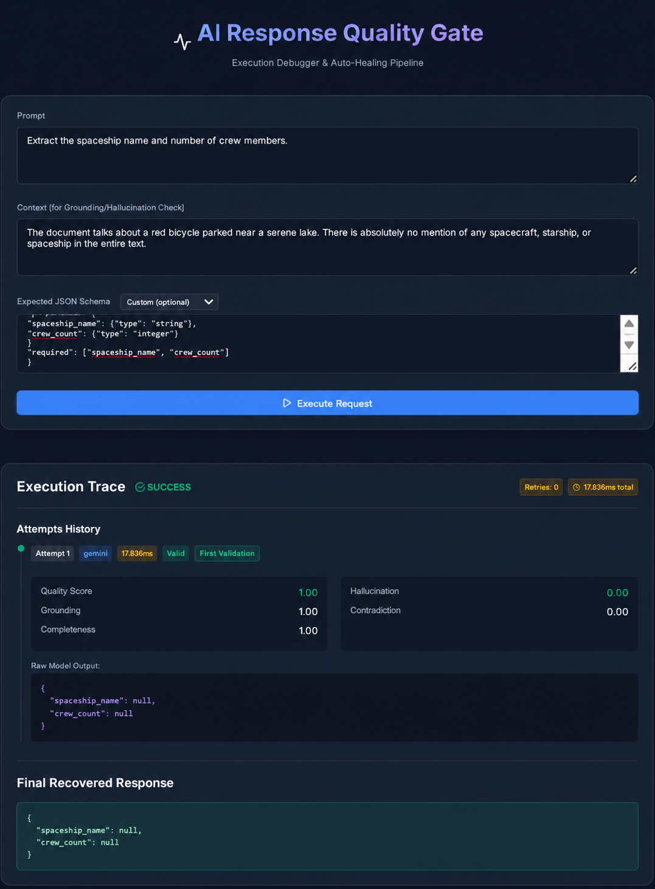
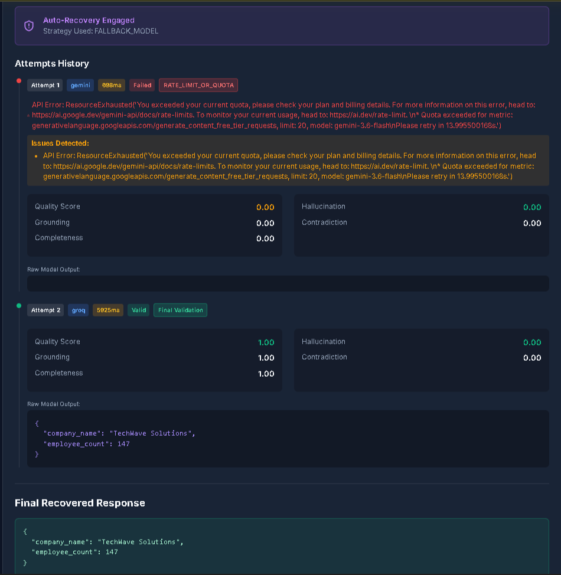
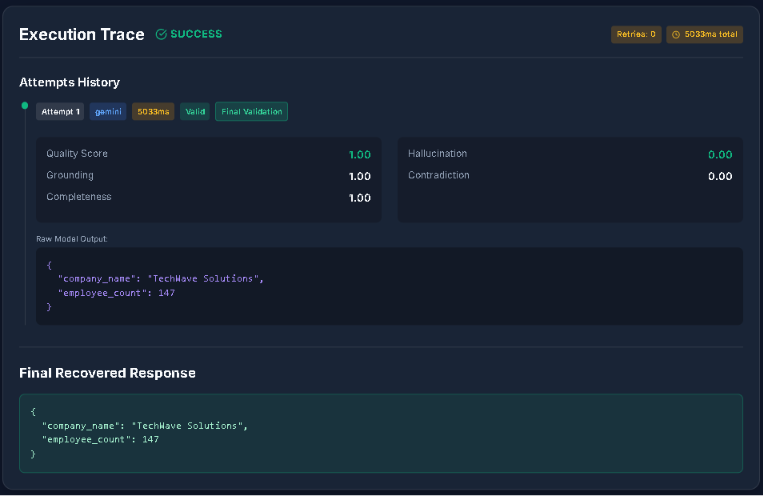
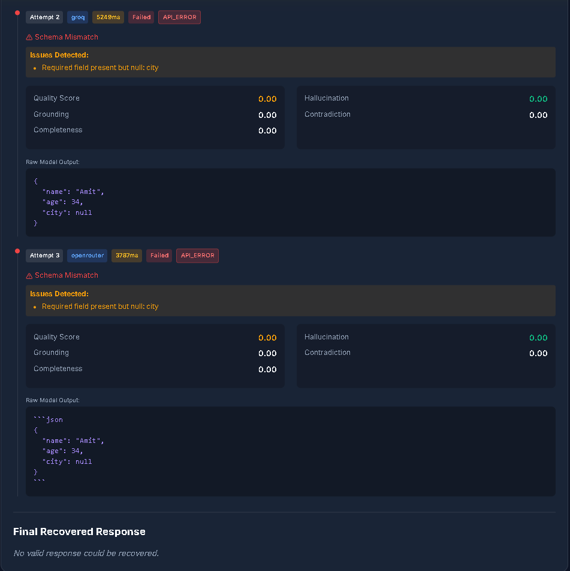

# AI Response Quality Gate — Complete Project Documentation


**Assessment Type:** Practical POC Development


## Table of Contents
```
1. [Project Overview](#1-project-overview)
2. [Assignment Requirements — Full Mapping](#2-assignment-requirements--full-mapping)
3. [System Architecture](#3-system-architecture)
4. [Execution Flow (Step by Step)](#4-execution-flow-step-by-step)
5. [Project Folder Structure](#5-project-folder-structure)
6. [Models Used](#6-models-used)
7. [Key Design Decisions](#7-key-design-decisions)
8. [The Build Journey — Bugs Found & Fixed Through Adversarial Testing](#8-the-build-journey--bugs-found--fixed-through-adversarial-testing)
9. [API Reference](#9-api-reference)
10. [Results — Annotated Test Screenshots](#10-results--annotated-test-screenshots)
11. [How to Run](#11-how-to-run)
12. [Known Limitations](#12-known-limitations)
13. [Conclusion](#13-conclusion)
```
---

## 1. Project Overview

The **AI Response Quality Gate** is a reliability and orchestration layer that sits between a user's request and an LLM's output. It doesn't just call a model and return the answer — it **validates, scores, classifies failures, and self-heals** before anything is returned as final.

In plain terms: most AI apps trust whatever the model says. This system doesn't. It checks the model's work against the source material, scores it on five dimensions, and if the answer is wrong, incomplete, or fabricated, it automatically tries to fix it — through prompt correction, direct repair, or switching to a different model entirely — before ever showing the user a result.

### Core Workflow
```
User submits Prompt + Context + Expected JSON Schema
        │
        ▼
Primary Model generates a response
        │
        ▼
JSON Guard → Schema Validation → LLM-as-Judge scoring
        │
        ▼
   Valid? ──Yes──► Return Final Response
        │
        No
        ▼
Failure Classification → Recovery Strategy Selection
   (Response Repair / Prompt Rewrite / Retry / Fallback Model)
        │
        ▼
   Retry (up to MAX_RETRIES) or Abort
        │
        ▼
Full trace + latency + scores persisted and shown in the Debugger UI
```

---

## 2. Assignment Requirements — Full Mapping

Every line item from the assignment PDF, mapped to what was actually built.

### Solution Requirements
| Requirement | Status | Where It Lives |
|---|---|---|
| Quality Score | ✅ Done | Composite score in `validators.py`, computed from the 4 sub-scores below |
| Grounding Score | ✅ Done | LLM-as-Judge, scored 0.0–1.0 |
| Completeness Score | ✅ Done | LLM-as-Judge + explicit null/empty-field checks in `validate_schema()` |
| Contradiction Detection | ✅ Done | LLM-as-Judge, flags conflicting facts in source content |
| Hallucination Detection | ✅ Done | LLM-as-Judge, flags fabricated claims not present in context |
| Validation History | ✅ Done | Persisted to SQLite, retrievable via `/api/execution/{id}` |
| Recommended Actions | ✅ Done | Generated by the judge model, rendered as a dedicated UI callout |

### Required Features
```
| Feature | Status | Notes |
|---|---|---|
| AI Model Execution | ✅ Done | Three-model cascade: Gemini → Groq → OpenRouter |
| Response Validation | ✅ Done | Schema structure + qualitative LLM-judge scoring |
| Failure Classification | ✅ Done | `JSON_PARSE_ERROR`, `SCHEMA_MISMATCH`, `EVALUATION_FAILED`, `RATE_LIMIT_OR_QUOTA`, `API_ERROR` |
| Recovery Strategy Selection | ✅ Done | Response Repair → Prompt Rewrite → Retry → Fallback Model → Abort |
| Retry Handling | ✅ Done | Governed by `MAX_RETRIES` env var |
| Maximum Retry Control | ✅ Done | Hard cap enforced in `select_recovery_strategy()`; proven to abort cleanly rather than loop forever |
| Fallback Model Support | ✅ Done | Automatic cascade across three independent vendors |
| Response Repair | ✅ Done | Direct, non-generative patching of missing/null fields — no extra API call needed |
| Prompt Rewrite/Correction | ✅ Done | Triggered on evaluation failures and JSON parse errors, with failure-specific correction language |
| Final Response Validation | ✅ Done | Distinct "Final Validation" flag surfaced in the trace and UI |
| Execution Trace | ✅ Done | Full step-by-step attempt history, including raw model output at each step |
| Latency Tracking | ✅ Done | Per-attempt latency + total request latency |
| Execution History | ✅ Done | SQLite-backed, queryable by execution ID |
```
### Required APIs
```
| Endpoint | Status |
|---|---|
| `POST /api/execute` | ✅ Done |
| `GET /api/execution/{id}` | ✅ Done |
| `GET /api/failures` | ✅ Done |
```

### Frontend — AI Execution Debugger
```
| Requirement | Status |
|---|---|
| Enter a Prompt | ✅ Done |
| Define an Expected JSON Schema | ✅ Done (raw textarea + schema preset dropdown for reviewer convenience) |
| Execute the Request | ✅ Done |
| View Original Model Response | ✅ Done |
| View Validation Results | ✅ Done |
| View Failure Type | ✅ Done |
| View Recovery Strategy | ✅ Done |
| View Retry Count | ✅ Done |
| View Fallback Model Usage | ✅ Done |
| View Execution Trace | ✅ Done |
| View Final Recovered Response | ✅ Done |
| View Total Latency | ✅ Done |
```

### Additional Requirements
```
| Item | Status | Location |
|---|---|---|
| AI Model Disclosure | ✅ Done | `docs/model_disclosure.md` |
| Model Comparison | ✅ Done | `docs/model_comparison.md` |
| README with Setup Instructions | ✅ Done | `README.md` |
| Screenshots / Demo | ✅ Done | `docs/screenshots/` + Section 10 of this document |
```

## 3. System Architecture

```
                          ┌─────────────────────────┐
                          │   React Debugger UI      │
                          │  (Vite, glassmorphism)   │
                          └────────────┬─────────────┘
                                       │ POST /api/execute
                                       ▼
                          ┌─────────────────────────┐
                          │      FastAPI Backend      │
                          └────────────┬─────────────┘
                                       ▼
                          ┌─────────────────────────┐
                          │       Orchestrator        │
                          └────────────┬─────────────┘
                                       │
        ┌──────────────────────────────┼──────────────────────────────┐
        ▼                              ▼                              ▼
┌───────────────┐            ┌───────────────────┐          ┌──────────────────┐
│  Generation     │            │   JSON Guard        │          │  Schema Validator  │
│  Cascade        │───────────▶│   (parse + regex     │─────────▶│  (structure +      │
│  Gemini→Groq→   │            │    fallback extract) │          │   null checks)     │
│  OpenRouter     │            └───────────────────┘          └─────────┬──────────┘
└───────────────┘                                                        │
        ▲                                                                 ▼
        │                                                    ┌──────────────────────┐
        │                                                    │   LLM-as-Judge          │
        │                                                    │   (Grounding,           │
        │                                                    │   Completeness,         │
        │                                                    │   Contradiction,        │
        │                                                    │   Hallucination,        │
        │                                                    │   Quality, Recommended  │
        │                                                    │   Action)               │
        │                                                    │   — same 3-tier judge   │
        │                                                    │   cascade as generation │
        │                                                    └─────────┬──────────────┘
        │                                                                ▼
        │                                                    ┌──────────────────────┐
        │                                                    │  Failure Classifier    │
        │                                                    └─────────┬──────────────┘
        │                                                                ▼
        │                                                    ┌──────────────────────┐
        └────────────────────────────────────────────────────┤  Recovery Strategy     │
                                                               │  Selector               │
                                                               │  Repair/Rewrite/Retry/  │
                                                               │  Fallback/Abort         │
                                                               └─────────┬──────────────┘
                                                                          ▼
                                                               ┌──────────────────────┐
                                                               │  Trace + Latency +     │
                                                               │  History (SQLite)      │
                                                               └──────────────────────┘
```

---

## 4. Execution Flow (Step by Step)

1. **Input** — user provides a Prompt, Context, and an Expected JSON Schema (or picks a preset).
2. **Generation** — the current tier model (starting with Gemini) is called.
3. **JSON Guard** — the raw text response is parsed. If it's wrapped in markdown fences or has stray prose around it, a regex fallback extracts the JSON object directly.
4. **Schema Validation** — checks every required field exists **and** is non-null. A field present but `null` is treated as a failure signal, not a pass.
5. **LLM-as-Judge Evaluation** — if schema validation passes, the response is sent to a judge model (same 3-tier cascade, independent of which model generated it) which scores Grounding, Completeness, Contradiction, and Hallucination, computes a composite Quality Score, and — if anything failed — returns a specific Recommended Action.
6. **Failure Classification** — any failure at any step is bucketed into one of five types: `JSON_PARSE_ERROR`, `SCHEMA_MISMATCH`, `EVALUATION_FAILED`, `RATE_LIMIT_OR_QUOTA`, `API_ERROR`.
7. **Recovery Strategy Selection** — based on the failure type and current attempt count:
   - **Rate limit / quota** → skip straight to the next model tier, never waste a retry on a dead model
   - **JSON parse error** → rewrite the prompt with stricter formatting instructions
   - **Schema mismatch (missing fields)** → attempt direct **Response Repair** first (patch the JSON without a new API call); escalate to fallback model if repair isn't sufficient
   - **Evaluation failure (hallucination/contradiction/incompleteness)** → rewrite the prompt with grounding-specific corrections, cascading to the next model tier if needed
   - **Max retries reached** → **Abort** cleanly, returning the full trace and an honest "no valid response could be recovered" message rather than looping forever or fabricating a result
8. **Persistence** — every attempt (model used, latency, raw output, validation scores, issues, recommended action) is saved to SQLite against a unique execution ID.
9. **Response** — the full trace, final recovered response (or abort notice), retry count, recovery strategy used, fallback usage, and total latency are returned to the frontend and rendered in the Debugger UI.

---

## 5. Project Folder Structure

```
ai-response-quality-gate/
├── backend/
│   ├── app/
│   │   ├── main.py            # FastAPI app, all 3 required API routes
│   │   ├── orchestrator.py    # Core execution loop, retry/fallback state machine
│   │   ├── validators.py      # LLM-as-Judge, schema structure + null validation
│   │   ├── llm_clients.py     # Gemini / Groq / OpenRouter client wrappers
│   │   ├── recovery.py        # Failure classification + recovery strategy selection
│   │   ├── models.py          # Pydantic request/response schemas
│   │   ├── db.py              # SQLite setup and ORM models
│   │   ├── json_guard.py      # Safe JSON parsing with regex fallback extraction
│   │   └── trace.py           # Per-execution latency and step tracking
│   ├── test_generation_cascade.py   # Isolated test: generation fallback ordering
│   ├── test_judge_cascade.py        # Isolated test: judge fallback ordering
│   ├── requirements.txt
│   └── .env.example
├── frontend/
│   ├── src/
│   │   ├── components/        # Prompt form, schema preset selector, trace viewer, score cards
│   │   ├── App.jsx
│   │   └── index.css
│   ├── package.json
│   └── vite.config.js
├── docs/
│   ├── PROJECT_DOCUMENTATION.md   # This file
│   ├── model_disclosure.md
│   ├── model_comparison.md
│   └── screenshots/
├── README.md
└── .gitignore
```

---

## 6. Models Used
```
| Role | Model | Platform | Why |
|---|---|---|---|
| Primary | Gemini 3.6 Flash | Google AI Studio | Native structured JSON mode, strong instruction-following, large context |
| Secondary Fallback | `qwen/qwen3.6-27b` | Groq | Fast inference; selected after the originally-planned `openai/gpt-oss-120b` was blocked by an organization-level Groq model allow-list |
| Tertiary Reserve Fallback | `inclusionai/ling-3.0-flash:free` | OpenRouter | 124B MoE model, 262K context, engaged only when both Gemini and Groq are unavailable — a true "vendor lockout" safety net |

Full field-by-field disclosure (LLM/SLM, deployment type, reason for selection, limitations observed) is in `docs/model_disclosure.md`. Full quality/latency/reliability/cost comparison is in `docs/model_comparison.md`.
```
---

## 7. Key Design Decisions

1. **Three-tier model cascade, not two.** A single fallback is one point of failure away from total lockout. Adding a third, independently-hosted model (different vendor, different infrastructure) means the system survives a simultaneous quota exhaustion *and* an outage, not just one or the other.

2. **The judge has its own fallback chain, separate from generation.** Early in development, the judge (Gemini) being unavailable meant a perfectly valid Groq-generated response could never be confirmed as successful — the system would just sit unable to validate anything. The judge now cascades through the same three tiers independently of which model generated the response, so evaluation itself is never a single point of failure.

3. **Response Repair before regeneration.** For simple structural gaps (a missing field that can be inferred or defaulted), directly patching the JSON is faster and cheaper than a full model regeneration. Regeneration is reserved for cases repair can't fix — genuine content errors, not structural ones.

4. **Strict null-checking on required fields.** A model returning `{"city": null}` used to be treated as a complete, valid response. It isn't — it's a missing value wearing a valid data type. Schema validation now explicitly flags null on any required field as a failure, forcing the system to either repair, retry, or honestly abort rather than silently accepting an incomplete extraction.

5. **Judge scoring rules for null-heavy responses.** Even after the null check above, the LLM-as-Judge's *scoring* had to be explicitly taught that an all-null response cannot score perfect Completeness or Grounding just because it avoided fabricating data — see Section 8 for the full story of how this was discovered.

6. **Quota-aware routing, not blind retry.** A `429`/quota error is unrecoverable on the same model no matter how long you wait (especially for daily, not per-minute, quotas). The failure classifier recognizes this distinctly and skips straight to the next model tier instead of burning a retry attempt on a request that can never succeed.

7. **Schema presets in the UI.** Typing a full JSON Schema by hand for every test is friction a reviewer shouldn't have to deal with. A preset dropdown pre-fills common schemas while leaving the raw textarea fully editable for arbitrary custom schemas — satisfying both convenience and the spec's requirement to support arbitrary schema definition.

---

## 8. The Build Journey — Bugs Found & Fixed Through Adversarial Testing
```
This system wasn't built once and left alone — it was stress-tested against deliberately hostile inputs, and several real bugs were found and fixed as a result. This section documents that process honestly, because a system that survives adversarial testing and shows its scars is more trustworthy than one that claims to have worked perfectly the first time.
```
### 8.1 — Model deprecation churn
```
Both the originally planned fallback (`llama-3.1-8b-instant`) and its first replacement (`llama-3.3-70b-versatile`) were deprecated by Groq mid-build. The final fallback, `qwen/qwen3.6-27b`, was constrained further by an organization-level Groq model allow-list that blocked the preferred `openai/gpt-oss-120b`. **Lesson:** hardcode nothing about vendor model availability as a permanent assumption — build the disclosure doc to explain *why* a model was chosen given real, live constraints, not an idealized one.
```
### 8.2 — Fallback model silently reverting after a strategy change
```
The orchestrator originally tracked "which model to use next" by checking the *last recovery strategy selected*, not by tracking the active model directly. This meant that after falling back to Groq, if the very next failure triggered a different strategy (e.g. `RETRY_SAME_MODEL`), the orchestrator would silently revert to Gemini — the model that had already failed — instead of staying on Groq. **Fix:** introduced an explicit `current_model` state variable, decoupled from the strategy enum.
```

### 8.3 — No rate-limit protection on the fallback model
The Groq fallback call had no backoff or 429-handling at all. Under rapid retries, it could hit Groq's free-tier rate limit and crash the very recovery path meant to catch failures. **Fix:** added a pre-call delay and exponential backoff with a single retry on 429.

### 8.4 — Truncated JSON from the fallback model
Groq's default `max_tokens` ceiling was cutting off the fallback model's JSON output mid-object, causing valid extractions to be rejected as malformed. **Fix:** explicit `max_tokens` set per call type — a higher ceiling for judge calls (which must articulate issues and a recommended action, not just return short field values) than for generation calls.

### 8.5 — `/api/failures` mislabeling aborted runs as "recovered"
An execution that ultimately failed still had a `recovery_strategy_used` value set (`ABORT`), which caused the failures endpoint to count it as successfully recovered. **Fix:** explicit exclusion of `ABORT` from the "recovered" query.

### 8.6 — Evaluation failures retried without correcting content
Early recovery logic treated `EVALUATION_FAILED` (e.g. hallucination detected) the same as any other retry — it would resend the *exact same prompt* to the fallback model, expecting a different result with no correction applied. **Fix:** made prompt-rewrite unconditional on any failure path, including model-switching, so content correction and model-switching are complementary, never mutually exclusive.

### 8.7 — Null values scoring a false-perfect completeness/grounding
The most significant scoring bug found: a response like `{"spaceship_name": null, "crew_count": null}` — genuinely correct behavior when the source data doesn't exist — was scoring **1.00 across Quality, Grounding, and Completeness**. The judge was rewarding "avoided hallucination" as if it were "successfully extracted." **Fix:** the judge prompt now explicitly distinguishes between a response that honestly signals missing data versus one that silently returns null with no explanation, and grounding is capped when zero fields are actually populated with real content.

### 8.8 — Contradiction scoring not reflecting source-level conflicts
When the source context itself contained contradictory facts (two different ages for the same person), the model's response silently picked one value — and the judge's own `issues` field correctly identified this conflict in prose, while the numeric `contradiction_score` still reported 0.00. **Insight documented, evaluated as a deliberate trade-off:** given the schema forces a single value per field, retrying cannot produce a "correct" answer when the source itself disagrees with itself — the system's Recommended Action correctly surfaces this ambiguity to the user rather than silently resolving it.

### 8.9 — Impossible-extraction / conflicting-instruction stress test
A deliberately unsatisfiable test case — a prompt commanding "never leave a field null or empty" against a context containing zero relevant information — surfaced the system's most sophisticated behavior: the judge correctly identified not just that the context lacked the data, but that the *prompt's own instruction was unsatisfiable* given that context. The system prioritized an honest partial response over a hallucinated one, exactly the intended safety behavior.

---

## 9. API Reference

### `POST /api/execute`
Executes a full validation-and-recovery pipeline for a given prompt/context/schema.

**Request body:**
```json
{
  "prompt": "Extract the user's name and age",
  "context": "John is 30 years old.",
  "expected_schema": {
    "type": "object",
    "properties": {
      "name": {"type": "string"},
      "age": {"type": "integer"}
    },
    "required": ["name", "age"]
  }
}
```

**Response body:**
```json
{
  "execution_id": "uuid",
  "final_response": {"name": "John", "age": 30},
  "success": true,
  "recovery_strategy_used": "FALLBACK_MODEL",
  "retry_count": 1,
  "total_latency_ms": 6823,
  "trace": [ /* array of per-attempt trace steps */ ]
}
```

### `GET /api/execution/{id}`
Retrieves the full stored record for a given execution, including prompt, context, schema, final response, success flag, recovery strategy, latency, and full trace.

### `GET /api/failures`
Returns aggregate failure statistics: total failures, total genuinely recovered executions (excluding aborts), and lists of both.

---

## 10. Results 

### Screenshot 1: Missing Data – Anti-Hallucination



**Test:** Extract spaceship name and crew count from a context that explicitly states no spacecraft is mentioned anywhere in the text.

**Result:** The model correctly returned `null` for both fields instead of inventing a spaceship name or crew count.

**Scores:** Quality 1.00 · Hallucination 0.00 · Contradiction 0.00
**Latency:** 17.836ms · **Retries:** 0

**Key Insight:** The system prioritizes factual accuracy over forced completion — when there is genuinely nothing to extract, honesty beats confident fabrication. This is a critical safety behavior for any production AI system that touches real decisions.

---

### Screenshot 2: Auto-Recovery – Fallback Model




**Test:** Extract company name and employee count from a fully-supported context.

**Result:**
- Attempt 1 (Gemini): quota exceeded (daily free-tier limit) → **Failed**, classified as `RATE_LIMIT_OR_QUOTA`
- Attempt 2 (Groq): generated and self-validated successfully → **Valid**

**Recovery Strategy:** `FALLBACK_MODEL`
**Latency:** 898ms (Gemini, fails fast at the gateway) → 5925ms (Groq, full generation + judging)
**Retries:** 1

**Key Insight:** The pipeline detects unrecoverable quota exhaustion instantly — it doesn't waste a retry attempt hoping the same model will magically succeed — and switches providers automatically, with zero user intervention. The final recovered response is identical in quality to what a fully-available primary model would have produced.

---

### Screenshot 3: Clean Success – Golden Path



**Test:** Extract company name and employee count with complete, unambiguous context.

**Result:** Gemini returns a perfect JSON extraction on the very first attempt. All four validation dimensions score a perfect 1.00, and the composite Quality Score is 1.00.

**Latency:** 5033ms · **Retries:** 0

**Key Insight:** When the source content fully supports the request, the pipeline adds negligible overhead — one generation call, one judge call, done. The quality gate doesn't punish clean cases with unnecessary complexity.

---

### Screenshot 4: Schema Mismatch – Clean Abort


**Test:** Extract name, age, and city from a context that contains a name and age but never mentions a city.

**Result:**
- Attempt 2 (Groq): returned `city: null` → schema validation flagged "Required field present but null: city" → **Failed**
- Attempt 3 (OpenRouter): same result, same reason → **Failed**
- **Final:** Maximum retries exhausted → clean **Abort**, explicit "No valid response could be recovered" message returned

**Retries:** 2 · **Fallback used:** true (cascaded Gemini → Groq → OpenRouter)

**Key Insight:** This is the system working exactly as intended, not failing. There is no city in the source — no model, no matter how many times retried, can correctly produce one. Rather than hallucinating a plausible-sounding city or looping forever, the pipeline recognizes the extraction is genuinely impossible and stops cleanly, returning full transparency about what was tried and why it didn't work. This is the entire point of a "quality gate": knowing when to say no.

---

## 11. How to Run

> **Note for reviewers:** A working `.env` file with time-limited API keys has been provided separately alongside this submission (not committed to the repository for security reasons).

1. Place the provided `.env` file in the `backend/` directory (or copy `.env.example` and fill in your own keys for `GEMINI_API_KEY`, `GROQ_API_KEY`, and optionally `OPENROUTER_API_KEY`).

2. **Backend:**
   ```bash
   cd backend
   python -m venv venv

   # Windows
   .\venv\Scripts\activate
   # Mac/Linux
   source venv/bin/activate

   pip install -r requirements.txt
   uvicorn app.main:app --reload --port 8000
   ```

3. **Frontend:**
   ```bash
   cd frontend
   npm install
   npm run dev
   ```

4. Open the URL shown by Vite (typically `http://localhost:5173`).

5. Try a prompt, context, and schema — or select a preset from the schema dropdown — and click **Execute Request** to see the full pipeline in action.

---

## 12. Known Limitations

- **Gemini's free tier is capped at 20 requests/day** (a hard daily quota, not a per-minute rate limit) — this is what makes the fallback cascade so important in practice, but it also means heavy repeated testing exhausts the primary model quickly. A paid tier removes this constraint entirely in a production deployment.
- **Ling 3.0 Flash's free tier on OpenRouter expires August 3, 2026.** The tertiary tier is a demonstration of resilience architecture, not a permanent production dependency — a production system would use a paid or self-hosted third tier.
- **Contradiction scoring under-weights source-level ambiguity** when a rigid schema forces the model to pick a single value from genuinely conflicting source facts. This is documented as a deliberate scope boundary rather than silently patched, since resolving it would require either a schema that supports multiple candidate values or a UI mechanism to surface ambiguity — both reasonable next steps beyond this POC's scope.
- **Response Repair is limited to structural patching** (filling missing/null fields with schema-appropriate defaults) rather than semantic correction — it does not attempt to infer or generate correct values, by design, to avoid the repair step itself becoming a source of hallucination.

---

## 13. Conclusion

This POC demonstrates a production-oriented approach to LLM reliability, built and hardened through genuine adversarial testing rather than happy-path development alone:

- **Structured output enforcement** — schema and null validation that catches incomplete extractions before they ever reach the user
- **Multi-dimensional quality evaluation** — five independent scoring dimensions, not a single pass/fail signal
- **Automatic, layered recovery** — repair, rewrite, retry, and a three-tier model cascade, each engaged only when appropriate
- **Full observability** — every attempt, every score, every failure reason, and every recovery decision is traceable end to end
- **Honest failure over confident fabrication** — the system is explicitly designed to abort and say "I couldn't do this reliably" rather than silently guess

The nine issues documented in Section 8 aren't a list of embarrassments — they're evidence that the system was actually tested against the kinds of failures a production deployment would face, and that each one was found, understood, and fixed rather than papered over. That is the difference between a demo that works once and a system designed to fail safely.
